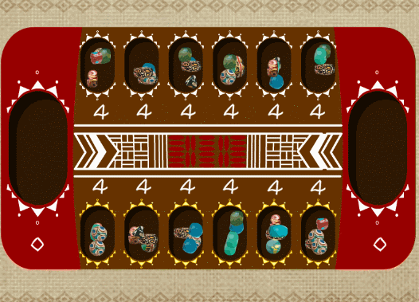

Mancala
=======

[Mancala](https://en.wikipedia.org/wiki/Mancala) is a family of traditional
board games with widely varying rules. In general, gameplay begins by placing a
certain number of _seeds_ in each _pit_ on the board. Players take turns
_sowing_ by selecting one of their pits, collecting all its seeds, and placing
one seed into each of the following pits in sequence (illustrated above -
[source](https://www.behance.net/gallery/28963121/Mancala)). The object is to
collect the most seeds in your _store_ - a large pit that you may sow to, but
not from.

This repository contains an implementation of the particular set of Mancala
rules that I played by as a kid:
- 2 players
- 6 pits + 1 store per player (players choose to sow from one of their 6 pits)
- each pit starts with 4 seeds
- sow counterclockwise
- when sowing, skip over your opponent's store
- you get an extra turn if the last seed during sowing lands in your store
- _relay sowing_: if the last seed during sowing lands in an occupied pit,
  continue by collecting & sowing from that pit; this continual re-sowing ends
  when your last seed lands in an empty pit

I'm using this as a toy project to try out [Go](https://golang.org/). The goal
is to write an AI to play the game perfectly, as I assume the game tree isn't
too unruly.
